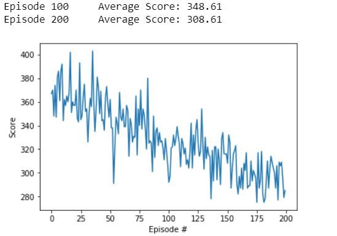
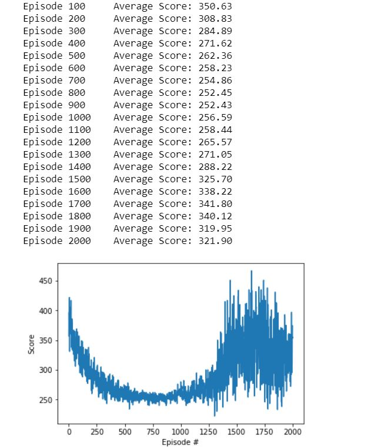
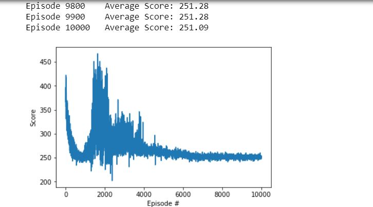

# N-Dimensional Prisoner's Dilemma
Multiple Agents were trained by playing N-player prisoners dilemma game against each other using reinforcement learning method. 
The agent looks at the previous 15 actions of each player and decides the current move. State is defined by the previous 15 moves combined. Each episode consists of T rounds where the agent learns, and changes its weights according the reward provided after each round. M episodes are played, and the state is refreshed after each game.

 
N=5 M=200 T=50

 
N=5 M=2000 T=50

 
N=5 M=10000 T=50

It can be noticed here that initially the models were competing with each other, resulting in gradual reduction in score. Later, models experimented cooperating for a possible uptick. When ran even further (refer figure 3), one can notice that they convergence to a particular score better than all cheat. 
